# ReKit MCP

**Kitbashing, level design, and viewport tools for Unreal Engine 5.5+ via MCP (Model Context Protocol)**

Place, browse, inspect, duplicate, and snap Content Browser meshes through AI — the core operations for modular kitbashing and level design. Capture viewport screenshots so Claude can see and iterate on placement. Built on top of the [flopperam/unreal-engine-mcp](https://github.com/flopperam/unreal-engine-mcp) foundation.

[](https://www.unrealengine.com/)
[](LICENSE)

---

## What ReKit Adds

These tools fill the critical gap between "AI can build from basic shapes" and "AI can kitbash with real game assets":

| **Tool** | **What It Does** |
|----------|-----------------|
| `spawn_static_mesh_actor` | Place any Content Browser mesh into the level at a specific transform |
| `list_content_browser_meshes` | Browse available static meshes by folder path and name filter |
| `get_actor_details` | Get mesh path, materials list, and bounding box for any actor |
| `duplicate_actor` | Copy a StaticMeshActor with offset, new rotation, or new scale |
| `snap_actors` | Align one actor's face flush against another using bounding box math |
| `take_screenshot` | Capture the active editor viewport as a PNG — returns the image to Claude for visual verification |

### Viewport Screenshot Loop

The `take_screenshot` tool lets Claude see what's in the UE5 viewport. This enables a **build → screenshot → verify → iterate** workflow where Claude can visually check its own kitbash work and fix issues autonomously.

```bash
# 1. Build a hab from modular pieces
> spawn_static_mesh_actor(name="Floor_01", mesh_path="/Game/ModularSciFi/.../SM_Modular_Merged.SM_Modular_Merged", ...)

# 2. Take a screenshot to verify placement
> take_screenshot()

# 3. Claude sees the image, spots a gap, and spawns a fix
> spawn_static_mesh_actor(name="Wall_Fix_01", ...)
```

### Example Kitbash Workflow

```bash
# 1. Discover what meshes are available
> list_content_browser_meshes(search_path="/Game/ModularSciFi/", name_filter="Wall")

# 2. Place a wall segment
> spawn_static_mesh_actor(name="Wall_01", mesh_path="/Game/ModularSciFi/.../SM_Wall", location=[0,0,0])

# 3. Check its dimensions
> get_actor_details(name="Wall_01")

# 4. Duplicate it with an offset
> duplicate_actor(source_name="Wall_01", new_name="Wall_02", offset=[500,0,0])

# 5. Snap pieces together
> snap_actors(moving_actor="Wall_02", target_actor="Wall_01", snap_face="right")
```

### Bug Fixes

- **SetActorLabel**: Spawned actors now display their given name in the Outliner instead of generic `StaticMeshActor_N` labels.
- **FlushRenderingCommands**: Screenshot capture no longer hangs — GPU pipeline is flushed before `ReadPixels()`.
- **Viewport fallback**: `take_screenshot` tries `GetActiveViewport()` first, then iterates all viewport clients to find one with valid dimensions.

---

## Full Tool Arsenal

ReKit includes all tools from the original unreal-engine-mcp, plus the kitbashing additions above.

| **Category** | **Tools** | **Description** |
|--------------|-----------|-----------------|
| **Kitbashing** | `spawn_static_mesh_actor`, `list_content_browser_meshes`, `get_actor_details`, `duplicate_actor`, `snap_actors` | Place, browse, inspect, copy, and align Content Browser meshes |
| **Viewport** | `take_screenshot` | Capture editor viewport as PNG for AI-driven visual verification |
| **PCG** | `generate_pcg`, `get_pcg_node_property`, `set_pcg_node_property`, `create_pcg_graph`, `add_pcg_node`, `connect_pcg_nodes`, `read_pcg_graph`, `assign_pcg_graph`, `set_pcg_graph_parameter`, `add_pcg_graph_parameter`, `set_pcg_spawner_entries` | Procedural Content Generation graph creation, editing, and execution |
| **Blueprint Scripting** | `add_node`, `connect_nodes`, `delete_node`, `set_node_property`, `create_variable`, `set_blueprint_variable_properties`, `create_function`, `add_function_input`, `add_function_output`, `delete_function`, `rename_function` | Complete Blueprint programming with 23+ node types |
| **Blueprint Analysis** | `read_blueprint_content`, `analyze_blueprint_graph`, `get_blueprint_variable_details`, `get_blueprint_function_details` | Deep inspection of Blueprint structure and execution flow |
| **World Building** | `create_town`, `construct_house`, `construct_mansion`, `create_tower`, `create_arch`, `create_staircase` | Procedural architectural structures from basic shapes |
| **Level Design** | `create_maze`, `create_pyramid`, `create_wall`, `create_castle_fortress`, `create_suspension_bridge`, `create_aqueduct` | Procedural level geometry and structures |
| **Materials** | `get_available_materials`, `apply_material_to_actor`, `apply_material_to_blueprint`, `set_mesh_material_color`, `get_actor_material_info` | Material discovery, assignment, and color control |
| **Physics** | `spawn_physics_blueprint_actor`, `set_physics_properties` | Physics simulation and dynamic objects |
| **Blueprint System** | `create_blueprint`, `compile_blueprint`, `add_component_to_blueprint`, `set_static_mesh_properties` | Blueprint creation and component management |
| **Actor Management** | `get_actors_in_level`, `find_actors_by_name`, `delete_actor`, `set_actor_transform` | Scene object control and inspection |

---

## Setup

### Prerequisites
- **Unreal Engine 5.5+**
- **Python 3.12+**
- **uv** (Python package manager)
- **MCP Client** (Claude Code, Claude Desktop, Cursor, or Windsurf)

### 1. Clone & Install Plugin

```bash
git clone https://github.com/LonglifeIO/rekit-mcp.git
cd rekit-mcp
```

**Add the plugin to your project:**
```bash
# Copy the plugin folder into your project
cp -r UnrealMCP/ YourProject/Plugins/

# Enable in Unreal Editor
# Edit > Plugins > Search "UnrealMCP" > Enable > Restart Editor
```

### 2. Configure Your MCP Client

Add to your MCP configuration file:

**Claude Code** (`.mcp.json` in project root):
```json
{
  "mcpServers": {
    "unrealMCP": {
      "command": "uv",
      "args": [
        "--directory",
        "/path/to/rekit-mcp/Python",
        "run",
        "unreal_mcp_server_advanced.py"
      ]
    }
  }
}
```

**Claude Desktop** (`~/.config/claude-desktop/mcp.json`), **Cursor** (`.cursor/mcp.json`), **Windsurf** (`~/.config/windsurf/mcp.json`) use the same format.

> **Note:** On Mac (and sometimes Windows), replace `"uv"` with the full path to the uv executable. Find it with `which uv` (Mac) or `where uv` (Windows).

### 3. Start Building

Open your UE5 project with the plugin enabled, then use your MCP client:

```bash
> "List all wall meshes in the ModularSciFi folder"
> "Place a door module at the entrance"
> "Duplicate Wall_01 three times along the X axis with 500cm spacing"
```

> **Setup issues?** See the [Debugging & Troubleshooting Guide](DEBUGGING.md).
>
> **Blueprint programming?** See the [Blueprint Graph Guide](Guides/blueprint-graph-guide.md).

---

## Architecture

```mermaid
graph TB
    A[AI Client<br/>Claude Code / Cursor / Windsurf] -->|MCP Protocol| B[Python Server<br/>unreal_mcp_server_advanced.py]
    B -->|TCP Socket| C[C++ Plugin<br/>UnrealMCP]
    C -->|Native API| D[Unreal Engine 5.5+]

    B --> E[Kitbashing Tools]
    E --> E1[Spawn / Browse / Duplicate]
    E --> E2[Inspect / Snap]

    B --> F[World Building]
    B --> G[Blueprint System]
    B --> H[Materials & Physics]
    B --> I[Viewport & PCG]
    I --> I1[Screenshot / Visual Verify]
    I --> I2[PCG Graph Tools]
```



---

## Credits

ReKit MCP is a fork of [flopperam/unreal-engine-mcp](https://github.com/flopperam/unreal-engine-mcp) with kitbashing and level design tools added by [LonglifeIO](https://github.com/LonglifeIO).

## License
MIT License
